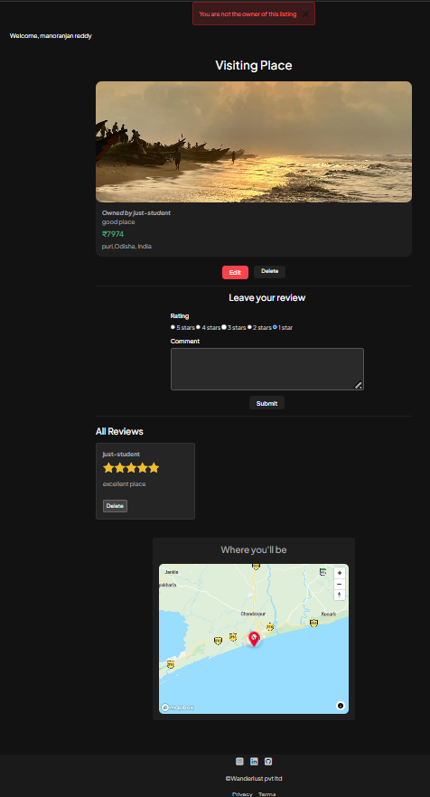
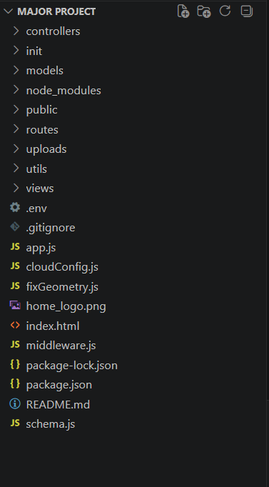

# 🏡 Wanderlust

> A full-stack Airbnb-inspired travel accommodation platform where users can explore destinations, create listings, upload images, write reviews, and manage their own properties.

---

## 📌 Overview

Wanderlust is a production-ready travel listing web application built using Node.js, Express.js, MongoDB, and EJS.

The platform allows authenticated users to create and manage travel listings, upload property images, search destinations, browse categories, review listings, and explore locations using interactive maps.

---

## ✨ Features

- 🔐 User Authentication (Register/Login/Logout)
- 🏠 Create, Edit & Delete Listings
- ☁️ Cloudinary Image Upload
- ⭐ Ratings & Reviews
- 🔍 Search Listings
- 🗂️ Category Filters
- 🗺️ Interactive Map (Mapbox)
- 📍 Location Based Listings
- 👤 Owner Authorization
- 🚫 Protected Routes
- ⚡ Flash Messages
- 🌙 Dark / Light Theme
- 📱 Responsive UI

---

## 🛠️ Tech Stack

### Frontend

- HTML5
- CSS3
- Bootstrap 5
- JavaScript
- EJS

### Backend

- Node.js
- Express.js

### Database

- MongoDB
- Mongoose

### Authentication

- Passport.js
- Passport Local
- Express Session

### Cloud Services

- Cloudinary
- Mapbox

### Other Packages

- Multer
- Joi Validation
- Connect Flash
- Method Override
- dotenv

---

# 📂 Project Structure

```
Wanderlust
│
├── controllers
├── init
├── models
├── public
├── routes
├── uploads
├── utils
├── views
│
├── app.js
├── middleware.js
├── cloudConfig.js
├── schema.js
├── package.json
└── README.md
```

---


# 📸 Application Screenshots

## 🏠 Home Page


---

## 🏠 Home Page (Display Price)


---

## ➕ Add New Listing


---

## 🏡 Listing Details, Reviews & Map


---

## ✏️ Edit Listing



---

## 📂 Project Structure




---

# ⚙️ Installation

Clone the repository

```bash
git clone https://github.com/yourusername/Wanderlust.git
```

Move into project

```bash
cd Wanderlust
```

Install dependencies

```bash
npm install
```

Create a `.env` file

```env
ATLASDB_URL=
SECRET=
CLOUD_NAME=
CLOUD_API_KEY=
CLOUD_API_SECRET=
MAP_TOKEN=
```

Start the application

```bash
node app.js
```

or

```bash
nodemon app.js
```

Open

```
http://localhost:8080
```

---

# 🔐 Authentication

- User Registration
- Login
- Logout
- Session Management
- Protected Routes

---

# 📌 CRUD Operations

### Listings

- Create Listing
- Read Listings
- Update Listing
- Delete Listing

### Reviews

- Add Review
- Delete Review

---

# 🔒 Security Features

- Password Hashing
- Session Authentication
- Route Protection
- Owner Authorization
- Input Validation using Joi


